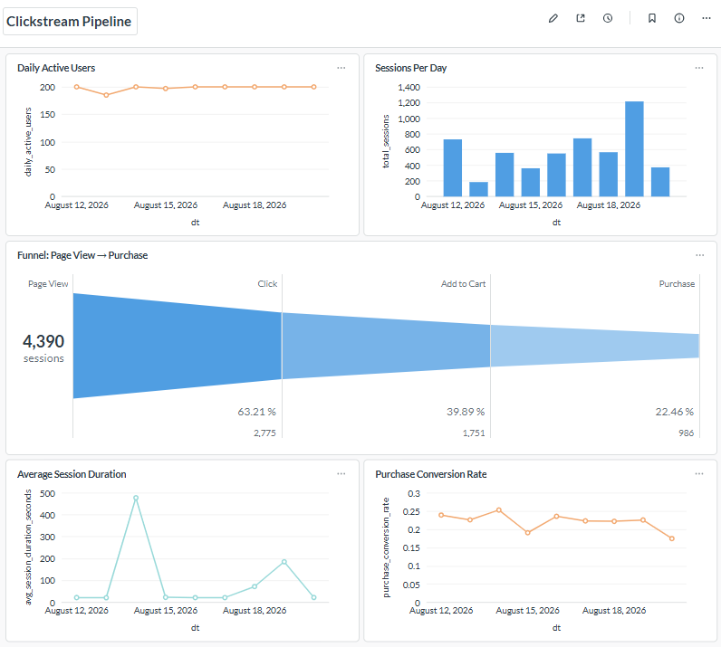

# Clickstream Analytics Pipeline

An end-to-end analytics pipeline built to learn and demonstrate Airflow
orchestration and Spark distributed processing. It simulates an
e-commerce website's clickstream, cleans and sessionizes the events,
computes funnel/engagement metrics, and loads the results into a
Postgres warehouse for dashboarding in Metabase.

## Dashbaord


## Architecture

```
[Event Generator] → raw/ (partitioned JSON)
                        |
                        v Airflow: clean_events
                  [Spark] validate, dedupe → processed/ (Parquet)
                        |
                        v Airflow: sessionize_events
                  [Spark] window functions:
                     - derive sessions from a 30-min inactivity gap
                     - compute session duration, pages viewed, funnel
                  → aggregated/sessions, aggregated/daily_metrics (Parquet)
                        |
                        v Airflow: load_to_warehouse
                  [Spark, JDBC] → Postgres warehouse
                     - fact_sessions
                     - fact_daily_metrics
                        |
                        v Airflow: validate_warehouse_data
                  Data quality gate (fails the DAG loudly on violation)
                        |
                        v
                   Metabase dashboard
```

Everything runs locally via Docker Compose: Airflow (webserver +
scheduler + its own Postgres metadata store), a Spark standalone
cluster (one master, one worker), a **separate** Postgres warehouse for
pipeline output, and Metabase.

## Why a medallion (bronze/silver/gold) layout

- **`raw/`** (bronze) — untouched JSON events, exactly as "generated" (stand-in for what a real event stream or web server log would produce)
- **`processed/`** (silver) — cleaned, deduplicated, typed Parquet
- **`aggregated/`** (gold) — business-level metrics: sessions and daily funnel/DAU stats
- **Postgres warehouse** — the gold tables, queryable via SQL, for BI tools

This separation means every stage can be re-run independently and
inspected on its own, which made debugging each phase of this project
far easier than one big monolithic script would have been.

## Key design decisions & lessons learned

- **Sessions are derived, not trusted.** Even though the generator
  tags events with a `session_id`, the pipeline recomputes real
  sessions from timestamps (30-minute inactivity gap) using Spark
  window functions (`lag`, running `sum` with `rowsBetween`) — this is
  the standard real-world sessionization technique.
- **Idempotent by construction.** Every Spark write uses
  `mode="overwrite"` with `spark.sql.sources.partitionOverwriteMode=dynamic`,
  so re-running any stage for the same data never double-counts or
  duplicates rows. This was verified by deliberately re-running every
  job back-to-back against the same output during development.
- **Data quality is a hard gate, not a suggestion.** The final DAG
  task queries the warehouse and fails the run if: any session key is
  duplicated, the funnel isn't monotonically decreasing
  (page_view ≥ click ≥ add_to_cart ≥ purchase), or any day has
  invalid DAU. These checks were tested against deliberately corrupted
  data to confirm they actually catch problems, not just pass
  silently.
- **Windows/Docker bind mounts have real POSIX-compatibility gaps.**
  Two Spark write settings (`partitionOverwriteMode=dynamic` and
  `mapreduce.fileoutputcommitter.algorithm.version=2`) exist
  specifically because whole-directory deletes and whole-directory
  renames are unreliable across the Windows↔WSL2↔container boundary.
  This generalizes: any pipeline mixing containers with different
  users/permissions writing to shared bind-mounted storage can hit the
  same class of bug, not just on Windows.
- **Full recompute, not incremental.** Every run reprocesses all
  historical data rather than doing incremental upserts. Simple and
  correct at this project's scale; the natural next step for a larger
  dataset would be incremental loads keyed by `dt`.

## Running it

```powershell
docker compose up -d --build
```

- Airflow UI: http://localhost:8080 (admin/admin)
- Spark master UI: http://localhost:8081
- Metabase: http://localhost:3000
- Warehouse Postgres: `localhost:5433` (user/password: `warehouse`/`warehouse`)

Trigger the `clickstream_pipeline` DAG manually, or let it run on its
`@daily` schedule.

### Backfilling historical dates

Since the DAG is schedule-aware (`@daily`) rather than manual-only, you
can backfill a range of past dates:

```powershell
docker compose exec airflow-scheduler airflow dags backfill \
    -s 2026-08-01 -e 2026-08-10 clickstream_pipeline
```

## Project structure

```
clickstream-pipeline/
├── docker-compose.yml
├── airflow/Dockerfile          # custom Airflow image with Java + PySpark
├── dags/
│   └── clickstream_pipeline_dag.py
├── generator/
│   └── generate_events.py      # synthetic clickstream event generator
├── spark-jobs/
│   ├── clean_events.py         # bronze -> silver
│   ├── sessionize_events.py    # silver -> gold (sessionization + funnel)
│   └── load_to_warehouse.py    # gold -> Postgres via JDBC
├── jars/
│   └── postgresql-42.7.4.jar   # vendored JDBC driver
├── raw/ processed/ aggregated/ # data zones (bind-mounted, gitignored)
└── logs/ plugins/ config/      # Airflow runtime dirs (gitignored)
```

## Possible next steps

- Swap the file-drop generator for real streaming (Kafka + Spark
  Structured Streaming)
- Incremental warehouse loads instead of full recompute
- Real alerting (Slack/email) instead of the log-based stand-in in
  `alert_on_failure`
- dbt on top of the warehouse for the transformation/testing layer
